<!-- README.md is generated from README.Rmd. Please edit that file -->

# MultiOutbreaks

<!-- badges: start -->
<!-- badges: end -->

MultiOutbreaks is created to implement a Bayesian copula-based modelling
of multi-type spatio-temporal epidemic data as presented in [(Adeoye et
al., 2026)](https://doi.org/10.48550/arXiv.2605.03608). The package is
built with different functionalities including model simulations,
Bayesian inference methods, model comparison methods, plotting of
results, etc.

# Dependencies

<!-- badges: start -->
<!-- badges: end -->

MultiOutbreaks features a complementary HMC sampling which depends on
Stan through its R interface, cmdstanr. If not already installed, you
can do so using

``` r
install.packages("cmdstanr", repos = c("https://mc-stan.org/r-packages/", getOption("repos")))
library(cmdstanr)
install_cmdstan()
```

## Installation

You can install the development version of MultiOutbreaks from
[GitHub](https://github.com/) with:

``` r
# install.packages("devtools")
devtools::install_github("Matthewadeoye/MultiOutbreaks")
```

## Simulation, visualization, inference, and outbreak detection.

An example showing how to simulate and plot multi-type space-time data
from model-0 described in [(Adeoye et al.,
2026)](https://doi.org/10.48550/arXiv.2605.03608):

``` r
library(MultiOutbreaks)
sim_adjmat<- matrix(0, nrow = 9, ncol = 9)
uppertriang<- c(1,0,1,0,0,0,0,0,1,0,1,0,0,0,0,0,0,1,0,0,0,1,0,1,0,0,1,0,1,0,0,0,1,1,0,1)
gdata::upperTriangle(sim_adjmat, byrow=TRUE)<- uppertriang
gdata::lowerTriangle(sim_adjmat, byrow=FALSE)<- uppertriang
set.seed(1234); mod0<- simulateMultiModel(Modeltype = 0, time = 60, nstrain = 5, adj.matrix = sim_adjmat)
multitypeFig(y=mod0[["y"]])
```


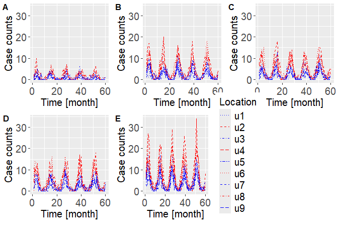

Inference using a fast purpose-built MCMC algorithm or Hamiltonian Monte
Carlo (HMC is slower):

``` r
MCMCfit0<- SMOOTHING_INFERENCE(y=mod0[["y"]], e_it=mod0[["e_it"]], Modeltype = 0, sim_adjmat, MCMC_iterations = 50000, HMC_iterations = 5000, Stan = FALSE)
#> Iteration: 1000 
#> Iteration: 2000 
#> Iteration: 3000 
#> Iteration: 4000 
#> Iteration: 5000 
#> Iteration: 6000 
#> Iteration: 7000 
#> Iteration: 8000 
#> Iteration: 9000 
#> Iteration: 10000 
#> Iteration: 11000 
#> Iteration: 12000 
#> Iteration: 13000 
#> Iteration: 14000 
#> Iteration: 15000 
#> Iteration: 16000 
#> Iteration: 17000 
#> Iteration: 18000 
#> Iteration: 19000 
#> Iteration: 20000 
#> Iteration: 21000 
#> Iteration: 22000 
#> Iteration: 23000 
#> Iteration: 24000 
#> Iteration: 25000 
#> Iteration: 26000 
#> Iteration: 27000 
#> Iteration: 28000 
#> Iteration: 29000 
#> Iteration: 30000 
#> Iteration: 31000 
#> Iteration: 32000 
#> Iteration: 33000 
#> Iteration: 34000 
#> Iteration: 35000 
#> Iteration: 36000 
#> Iteration: 37000 
#> Iteration: 38000 
#> Iteration: 39000 
#> Iteration: 40000 
#> Iteration: 41000 
#> Iteration: 42000 
#> Iteration: 43000 
#> Iteration: 44000 
#> Iteration: 45000 
#> Iteration: 46000 
#> Iteration: 47000 
#> Iteration: 48000 
#> Iteration: 49000 
#> Iteration: 50000 
#> Time difference of 3.645388 mins
mcmc.plot(MCMCfit0)
```

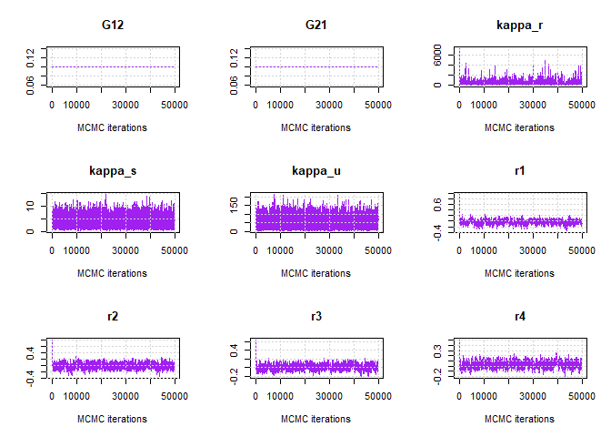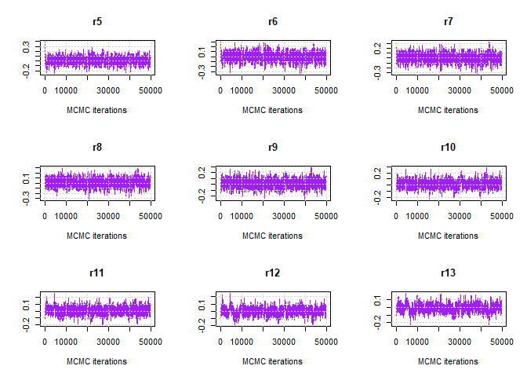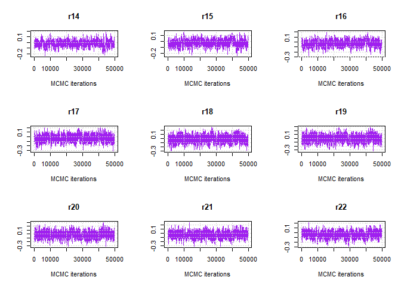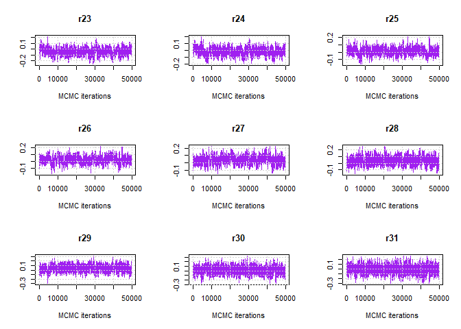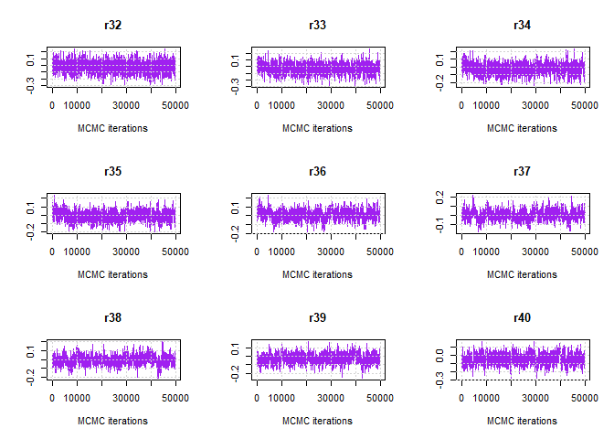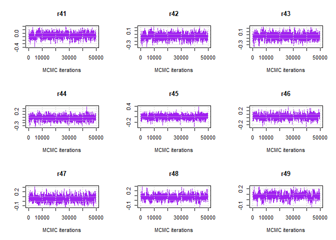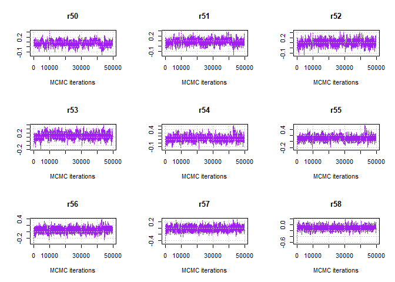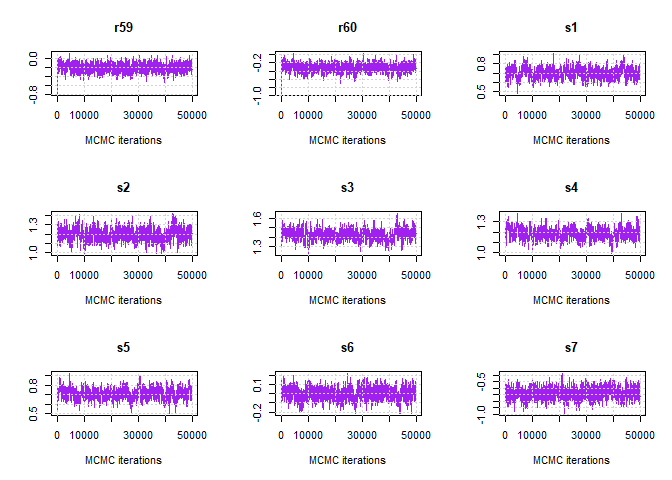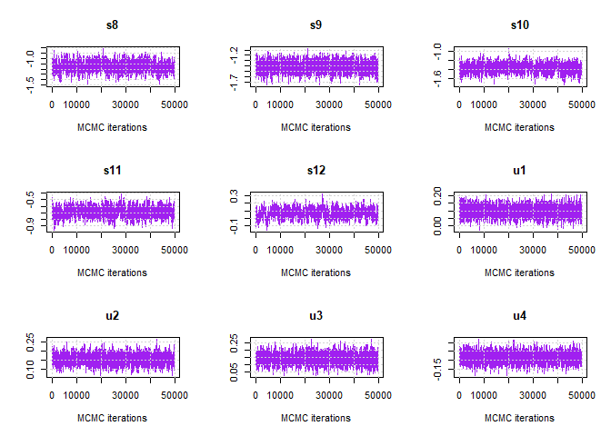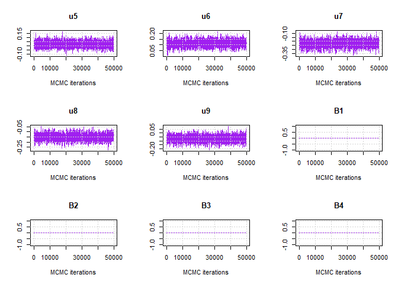

``` r
inf.plot(MCMCfit0)
```

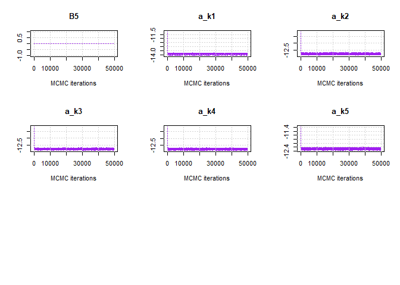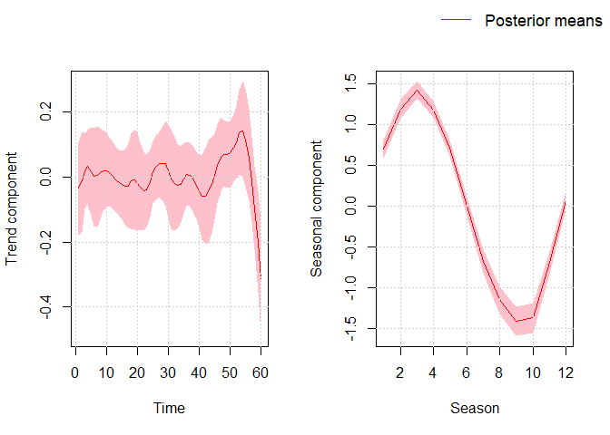

``` r

#HMCfit0<- SMOOTHING_INFERENCE(y=mod0[["y"]], e_it=mod0[["e_it"]], Modeltype = 0, sim_adjmat, MCMC_iterations = 15000, HMC_iterations = 5000, Stan = TRUE, GPU = FALSE)
```

Simulation, inference and multi outbreak detection as described in
[(Adeoye et al., 2026)](https://doi.org/10.48550/arXiv.2605.03608):

``` r
library(MultiOutbreaks)
sim_adjmat<- matrix(0, nrow = 9, ncol = 9)
uppertriang<- c(1,0,1,0,0,0,0,0,1,0,1,0,0,0,0,0,0,1,0,0,0,1,0,1,0,0,1,0,1,0,0,0,1,1,0,1)
gdata::upperTriangle(sim_adjmat, byrow=TRUE)<- uppertriang
gdata::lowerTriangle(sim_adjmat, byrow=FALSE)<- uppertriang
set.seed(1234); mod1<- simulateMultiModel(Modeltype = 1, time = 60, nstrain = 5, adj.matrix = sim_adjmat, B = c(1.2,2.4,1.1,0.4,0.7))
#multitypeFig(y=mod1[["y"]])

#MCMCfit1<- SMOOTHING_INFERENCE(y=mod1[["y"]], e_it=mod1[["e_it"]], Modeltype = 1, sim_adjmat, MCMC_iterations = 15000, HMC_iterations = 5000, Stan = FALSE, GPU = FALSE)
#mcmc.plot(MCMCfit1)
#inf.plot(MCMCfit1)

#MarginalProbabilitiesMCMC<- Posteriormultstrain.Decoding(y=mod1[["y"]],e_it=mod1[["e_it"]],inf.object = MCMCfit1,Modeltype = 1,y_total = NULL,thinningL = 10,burn.in = 2000)
#image(t(MarginalProbabilitiesMCMC[,,1]))
```

Compute model evidence (log marginal likelihood) through Bridge or
importance sampling for any model fitted by MultiOutbreaks:

``` r
library(MultiOutbreaks)
sim_adjmat<- matrix(0, nrow = 9, ncol = 9)
uppertriang<- c(1,0,1,0,0,0,0,0,1,0,1,0,0,0,0,0,0,1,0,0,0,1,0,1,0,0,1,0,1,0,0,0,1,1,0,1)
gdata::upperTriangle(sim_adjmat, byrow=TRUE)<- uppertriang
gdata::lowerTriangle(sim_adjmat, byrow=FALSE)<- uppertriang
set.seed(1234); mod1<- simulateMultiModel(Modeltype = 1, time = 60, nstrain = 5, adj.matrix = sim_adjmat, B = c(1.2,2.4,1.1,0.4,0.7))
#MCMCfit1<- SMOOTHING_INFERENCE(y=mod0[["y"]], e_it=mod0[["e_it"]], Modeltype = 1, sim_adjmat, MCMC_iterations = 15000, HMC_iterations = 5000, Stan = FALSE, GPU = FALSE)
#ModelEvidenceBridgeSamplingPackage(y=mod1[["y"]],e_it = mod1[["e_it"]],adjmat = sim_adjmat,Modeltype =1 ,inf.object = MCMCfit1,y_total = NULL)
#ModelEvidence(y=mod1[["y"]],e_it = mod1[["e_it"]],adjmat = sim_adjmat,Modeltype =1 ,inf.object = MCMCfit1, num_samples = 5000,y_total = NULL)
```
